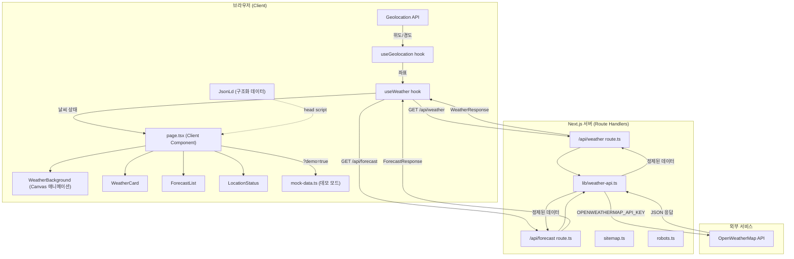

# 아키텍처 설계 문서

## 프로젝트 개요

- **프로젝트명**: 지금 날씨 (Weather Now)
- **설명**: 브라우저 Geolocation API로 현재 위치를 감지하여 실시간 날씨와 5일 예보를 제공하는 단일 페이지 웹앱
- **타깃 사용자**: 빠르게 날씨를 확인하려는 일반 사용자 (모바일 우선)
- **프로젝트 규모**: 소규모 (MVP)
- **최종 업데이트**: 2026-04-05

---

## 기능 요구사항

| # | 기능 | 설명 | 우선순위 | 상태 |
|---|------|------|---------|------|
| FR-1 | 위치 감지 | 브라우저 Geolocation API로 위도/경도 자동 감지. 권한 거부 시 서울(37.5665, 126.9780) 기본값 사용 | P0 | ✅ 구현 완료 |
| FR-2 | 현재 날씨 | 온도, 체감온도, 습도, 풍속/풍향, 날씨 상태, 날씨 아이콘 표시 | P0 | ✅ 구현 완료 |
| FR-3 | 5일 예보 | 3시간 간격 데이터를 일별로 집계하여 최고/최저 기온, 아이콘, 강수 확률 표시 | P0 | ✅ 구현 완료 |
| FR-4 | 날씨 아이콘 | OpenWeatherMap 아이콘 코드 기반 시각적 표현 | P1 | ✅ 구현 완료 |
| FR-5 | 반응형 UI | 모바일(375px), 태블릿(768px), 데스크톱(1280px) 대응 | P1 | ✅ 구현 완료 |
| FR-6 | 캔버스 배경 애니메이션 | 날씨 상태별 Canvas 기반 파티클 애니메이션 (비, 눈, 별, 안개 등) | P1 | ✅ 구현 완료 |
| FR-7 | 데모 모드 | `?demo=true` 파라미터로 API 호출 없이 목업 데이터 미리보기 | P2 | ✅ 구현 완료 |
| FR-8 | SEO / GEO / AEO | 검색엔진·AI 검색·음성검색 최적화 메타데이터 및 구조화 데이터 | P2 | ✅ 구현 완료 |

## 비기능 요구사항

| # | 항목 | 요구사항 |
|---|------|---------|
| NFR-1 | 성능 | 초기 로드 3초 이내, API 응답 2초 이내 (OpenWeatherMap 의존) |
| NFR-2 | 보안 | API 키는 서버사이드 Route Handler에서만 사용. 클라이언트에 노출 금지 |
| NFR-3 | 가용성 | Vercel Edge Network 활용. API 오류 시 사용자 친화적 에러 메시지 표시 |
| NFR-4 | 접근성 | 날씨 아이콘에 alt 텍스트 제공, 키보드 접근 가능 구조, ARIA 레이블 |
| NFR-5 | SEO | 검색엔진 인덱싱, Open Graph, Twitter Card, JSON-LD 구조화 데이터 |
| NFR-6 | PWA | Web App Manifest, 홈 화면 추가 지원, 테마 컬러 |

---

## 기술 스택

| 구분 | 기술 | 선택 근거 |
|------|------|----------|
| 프레임워크 | Next.js 14+ (App Router) | Route Handler로 API 키 보호, Server Components로 초기 렌더링 최적화 |
| 언어 | TypeScript | OpenWeatherMap 응답 타입 안전성 확보 |
| 스타일 | Tailwind CSS v4 | 반응형 유틸리티 클래스로 빠른 UI 구현 |
| 날씨 데이터 | OpenWeatherMap API | 무료 플랜으로 Current Weather + 5 Day Forecast 제공 |
| 상태관리 | React useState + Custom Hooks | MVP 규모에 적합. 외부 라이브러리 불필요 |
| 애니메이션 | Canvas API (requestAnimationFrame) | 날씨별 파티클 애니메이션. 외부 라이브러리 없이 구현 |
| SEO/AEO | Next.js Metadata API + JSON-LD | 검색엔진·AI 검색·음성검색 최적화 |
| 배포 | Vercel | Next.js 최적화 환경, 환경변수 관리 용이, Edge Network |
| CI/CD | GitHub Actions | main 브랜치 push 시 자동 빌드·배포 |

**트레이드오프**:
- React Query 미사용: MVP 규모에서 단순한 useState 패턴 선택. 캐싱 최적화가 필요하면 도입 권장.
- 클라이언트 상태 관리 라이브러리 미사용: 단일 페이지 단방향 데이터 흐름이므로 충분함.
- Canvas 애니메이션: 외부 라이브러리 없이 구현하여 번들 크기 최소화. 복잡한 효과 추가 시 three.js/lottie 검토.

---

## 시스템 아키텍처



**데이터 흐름**:

1. `layout.tsx`가 `<head>`에 JSON-LD 구조화 데이터를 삽입한다 (SEO/AEO).
2. 브라우저 로드 시 `useGeolocation`이 `navigator.geolocation.getCurrentPosition()`을 호출한다.
3. 위치 획득 성공 시 실제 좌표를, 실패 시 서울 기본값(37.5665, 126.9780)을 반환한다.
4. `?demo=true` 파라미터가 있으면 `mock-data.ts`의 목업 데이터를 사용하고 API를 호출하지 않는다.
5. `useWeather`가 좌표를 받아 `/api/weather`와 `/api/forecast`를 `Promise.all`로 병렬 호출한다.
6. Next.js Route Handler가 `OPENWEATHERMAP_API_KEY`로 OWM API를 호출한다. 키는 서버에만 존재한다.
7. `weather-api.ts`가 OWM 응답을 앱 타입으로 변환하여 반환한다.
8. `page.tsx`가 날씨 상태에 따라 `WeatherBackground`(Canvas 애니메이션)를 렌더링하고, 데이터를 각 컴포넌트로 전달한다.

---

## 디렉토리 구조

```
weather/
├── src/
│   ├── app/
│   │   ├── layout.tsx              — 루트 레이아웃 (SEO 메타데이터, JSON-LD, 폰트)
│   │   ├── page.tsx                — 메인 페이지 (Client Component, 데모 모드 포함)
│   │   ├── globals.css             — Tailwind v4 베이스 스타일
│   │   ├── sitemap.ts              — /sitemap.xml 자동 생성
│   │   ├── robots.ts               — /robots.txt 자동 생성
│   │   └── api/
│   │       ├── weather/
│   │       │   └── route.ts        — GET /api/weather?lat=&lon= (현재 날씨)
│   │       └── forecast/
│   │           └── route.ts        — GET /api/forecast?lat=&lon= (5일 예보)
│   ├── components/
│   │   ├── WeatherBackground.tsx   — Canvas 기반 날씨별 배경 애니메이션
│   │   ├── WeatherCard.tsx         — 현재 날씨 카드 (온도, 체감온도, 습도, 풍속)
│   │   ├── ForecastList.tsx        — 예보 목록 (5일 일별 카드)
│   │   ├── WeatherIcon.tsx         — 날씨 아이콘 (OWM 아이콘 코드 → next/image)
│   │   ├── LocationStatus.tsx      — 위치 상태 표시 (로딩 / 권한 거부 / 도시명)
│   │   └── JsonLd.tsx              — JSON-LD 구조화 데이터 (WebApp, FAQ, Speakable)
│   ├── hooks/
│   │   ├── useGeolocation.ts       — Geolocation API 래퍼 hook
│   │   └── useWeather.ts           — 날씨/예보 데이터 fetch + 상태 관리 hook
│   └── lib/
│       ├── weather-api.ts          — OpenWeatherMap API 호출 및 응답 변환 (server-only)
│       ├── types.ts                — 공유 TypeScript 인터페이스 정의
│       └── mock-data.ts            — 데모 모드용 목업 데이터
├── public/
│   └── manifest.json               — PWA Web App Manifest
├── .env.local                      — 로컬 환경변수 (gitignore)
├── .env.local.example              — 환경변수 템플릿 (커밋됨)
├── .github/
│   └── workflows/
│       └── deploy.yml              — GitHub Actions CI/CD
├── next.config.ts                  — Next.js 설정 (OWM 이미지 도메인 허용)
└── tsconfig.json
```

---

## 날씨별 캔버스 애니메이션 (`WeatherBackground.tsx`)

| 날씨 조건 | 배경 그라데이션 | 캔버스 효과 |
|----------|-------------|-----------|
| `Clear` (낮) | 황금 → 오렌지 → 하늘 | 떠오르는 반짝이 파티클 + 태양 글로우 |
| `Clear` (밤) | 남색 → 짙은 파랑 | 별 깜빡임 + 초승달 |
| `Clouds` | 슬레이트 → 회색 | 천천히 흘러가는 구름 덩어리 |
| `Rain` / `Drizzle` | 짙은 파랑-회색 | 대각선 빗줄기 |
| `Thunderstorm` | 짙은 보라-검정 | 빗줄기 + 랜덤 번개 플래시 |
| `Snow` | 연파랑-흰색 | 흔들리며 떨어지는 눈송이 |
| `Mist` / `Fog` / `Haze` | 회색-베이지 | 천천히 이동하는 반투명 안개 블롭 |

낮/밤 구분은 OWM 아이콘 코드의 `n` 접미사로 판별한다 (`"01n"` → 밤).

---

## SEO / GEO / AEO 구성 (`layout.tsx`, `JsonLd.tsx`)

| 구분 | 항목 | 구현 위치 |
|------|------|---------|
| **SEO** | title template, description, keywords, robots, canonical, alternates | `layout.tsx` metadata |
| **Open Graph** | og:title, og:description, og:image (1200×630), og:locale, og:type | `layout.tsx` metadata |
| **Twitter Card** | summary_large_image, title, description, image | `layout.tsx` metadata |
| **GEO** | geo.region: KR, geo.placename: South Korea | `layout.tsx` metadata.other |
| **AEO** | JSON-LD WebApplication, FAQPage, Speakable schema | `JsonLd.tsx` |
| **PWA** | Web App Manifest, themeColor, apple-mobile-web-app | `manifest.json`, `layout.tsx` |
| **Sitemap** | /sitemap.xml (changeFrequency: hourly) | `sitemap.ts` |
| **Robots** | /robots.txt (index: true, follow: true) | `robots.ts` |

---

## 데모 모드 (`?demo=true`)

API 키 미발급 또는 활성화 대기 시 목업 데이터로 UI를 미리 확인할 수 있다.

- URL: `http://localhost:3000/?demo=true`
- `mock-data.ts`의 `MOCK_WEATHER`, `MOCK_FORECAST` 상수를 사용
- API 호출 없음 (`useWeather`에 `NaN` 좌표 전달하여 fetch 차단)
- 상단에 노란 배너로 데모 모드임을 표시

---

## 팀별 전달 사항

### 프론트엔드
- `page.tsx`: `'use client'`. `useSearchParams`로 `?demo=true` 감지. `WeatherBackground`가 `position: fixed` 캔버스로 전체 배경을 담당하므로, 나머지 콘텐츠는 `relative z-10`으로 올려야 한다.
- `WeatherBackground`: `condition`과 `icon` prop으로 날씨 상태와 낮/밤을 전달한다.
- `JsonLd`: `layout.tsx`의 `<head>` 안에 삽입한다 (`dangerouslySetInnerHTML` 사용).

### 백엔드
- API 키 보호: `import 'server-only'`가 `weather-api.ts` 최상단에 선언되어 있다.
- `cacheLife` 디렉티브: 현재 날씨 10분, 예보 1시간 캐시.
- 파라미터 검증: 존재 여부 → 숫자 형식 → 범위(-90~90, -180~180) 3단계.

### DevOps
- 환경변수: `OPENWEATHERMAP_API_KEY` (필수), `NEXT_PUBLIC_BASE_URL` (SEO 메타데이터용, 선택).
- PWA 아이콘: `public/icon-192.png`, `public/icon-512.png`, `public/apple-icon.png`를 직접 준비해야 한다.
- OG 이미지: `public/og-image.png` (1200×630px)를 직접 준비해야 한다.
