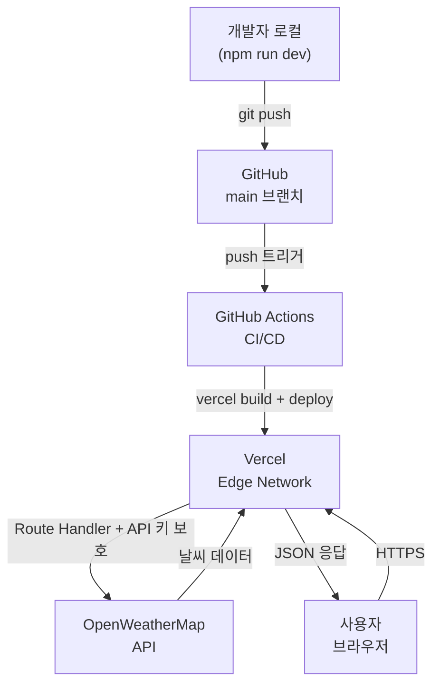

# 배포 가이드

- **최종 업데이트**: 2026-04-05

## 환경변수 목록

| 변수명 | 설명 | 필수 | 노출 범위 |
|--------|------|------|---------|
| `OPENWEATHERMAP_API_KEY` | OpenWeatherMap API 인증 키 | ✅ 필수 | 서버사이드 전용 |
| `NEXT_PUBLIC_BASE_URL` | 배포 앱 도메인 (SEO 메타데이터용) | 권장 | 클라이언트 포함 |

```bash
# .env.local 예시
OPENWEATHERMAP_API_KEY=a1b2c3d4e5f6...
NEXT_PUBLIC_BASE_URL=https://your-app.vercel.app
```

---

## 1. API 키 발급 (OpenWeatherMap)

1. [openweathermap.org](https://openweathermap.org) 에서 **Sign Up**
2. 이메일 인증 완료
3. **My Profile → API keys** 이동
4. `Default` 키 복사 (또는 **Generate**로 신규 생성)
5. **키 활성화까지 최대 2시간 소요** — 그동안 `?demo=true` 모드로 UI 확인 가능

> 무료 플랜: Current Weather + 5 Day Forecast API 사용 가능 (분당 60회, 월 100만 회)

---

## 2. 로컬 개발

```bash
# 저장소 클론
git clone https://github.com/<username>/weather.git
cd weather
npm install

# 환경변수 설정
cp .env.local.example .env.local
# .env.local 파일을 열어 API 키 및 BASE_URL 입력

# 개발 서버 실행
npm run dev
# http://localhost:3000

# API 키 없이 UI 미리보기 (데모 모드)
# http://localhost:3000/?demo=true
```

---

## 3. Vercel 배포

### 방법 1: GitHub 연동 (권장)

1. [vercel.com](https://vercel.com) 에 GitHub 계정으로 로그인
2. **Add New → Project** → `weather` 저장소 선택
3. 설정 확인:
   - Framework Preset: `Next.js` (자동 감지)
   - Root Directory: `./`
4. **Environment Variables** 섹션에서 추가:
   - `OPENWEATHERMAP_API_KEY` → 실제 키 값 → Production/Preview/Development 모두 선택
   - `NEXT_PUBLIC_BASE_URL` → `https://your-project.vercel.app` (배포 후 확인)
5. **Deploy** 클릭

### 방법 2: Vercel CLI

```bash
npm install -g vercel
vercel login
vercel link

# 환경변수 등록
vercel env add OPENWEATHERMAP_API_KEY
vercel env add NEXT_PUBLIC_BASE_URL

# 프리뷰 배포
vercel

# 프로덕션 배포
vercel --prod
```

### 환경변수 관리

```bash
vercel env ls                          # 등록된 목록 확인
vercel env pull .env.local             # Vercel → 로컬 동기화
vercel env rm OPENWEATHERMAP_API_KEY   # 삭제
```

---

## 4. CI/CD (GitHub Actions)

`.github/workflows/deploy.yml`이 자동으로 설정되어 있다.

| 이벤트 | 동작 |
|--------|------|
| PR 생성/업데이트 | 빌드 검증 + Vercel 프리뷰 배포 |
| `main` 브랜치 push | 빌드 검증 + Vercel 프로덕션 배포 |

### GitHub Secrets 등록

**GitHub 저장소 → Settings → Secrets and variables → Actions**

| Secret | 획득 방법 |
|--------|---------|
| `VERCEL_TOKEN` | [vercel.com/account/tokens](https://vercel.com/account/tokens) |
| `VERCEL_ORG_ID` | `vercel link` 후 `.vercel/project.json`의 `orgId` |
| `VERCEL_PROJECT_ID` | `vercel link` 후 `.vercel/project.json`의 `projectId` |

```bash
# .vercel/project.json 예시 (vercel link 후 생성됨)
{
  "projectId": "prj_xxxxxxxxxxxx",
  "orgId": "team_xxxxxxxxxxxx"
}
```

---

## 5. PWA 아이콘 준비

`manifest.json`이 이미 설정되어 있으나, 아이콘 이미지 파일을 직접 준비해야 한다.

| 파일 경로 | 크기 | 용도 |
|---------|------|------|
| `public/icon-192.png` | 192×192px | Android 홈 화면 |
| `public/icon-512.png` | 512×512px | Android 스플래시, PWA |
| `public/apple-icon.png` | 180×180px | iOS 홈 화면 |
| `public/og-image.png` | 1200×630px | OG/Twitter 카드 |
| `public/favicon.ico` | 32×32px | 브라우저 탭 |

---

## 6. NEXT_PUBLIC_BASE_URL 설정

SEO 메타데이터(canonical URL, sitemap, OG image)에 사용된다.

```bash
# 배포 후 실제 URL로 업데이트
# Vercel 대시보드에서 확인: Settings → Domains
vercel env add NEXT_PUBLIC_BASE_URL
# 값: https://your-project-name.vercel.app
```

커스텀 도메인 사용 시 해당 도메인으로 변경:
```
NEXT_PUBLIC_BASE_URL=https://weather.yourdomain.com
```

---

## 7. 인프라 구성도



---

## 8. 모니터링

| 항목 | 도구 | 설정 방법 |
|------|------|---------|
| 성능 모니터링 | Vercel Analytics | 대시보드 → Analytics → Enable |
| 웹 바이탈 | Vercel Speed Insights | `npm install @vercel/speed-insights` → `layout.tsx`에 `<SpeedInsights />` 추가 |
| 에러 로그 | Vercel Functions 탭 | 대시보드 → Functions → 실시간 로그 |
| OWM 사용량 | OWM 대시보드 | openweathermap.org → My Profile → API keys |

---

## 9. 커스텀 도메인 연결

1. Vercel 대시보드 → 프로젝트 → **Settings → Domains** → 도메인 추가
2. DNS 설정:
   - 루트 도메인: `A` 레코드 → `76.76.21.21`
   - 서브도메인: `CNAME` → `cname.vercel-dns.com`
3. DNS 전파 완료 후(최대 48시간) HTTPS 자동 활성화
4. `NEXT_PUBLIC_BASE_URL` 환경변수를 커스텀 도메인으로 업데이트

---

## 10. 롤백 절차

```bash
# 배포 목록 확인
vercel ls

# 특정 배포를 프로덕션으로 승격
vercel promote <deployment-url>
```

또는 Vercel 대시보드 → **Deployments** → 대상 배포 → **Promote to Production**

---

## 11. 보안 체크리스트

- [x] HTTPS 강제 (Vercel 기본 제공)
- [x] API 키 서버사이드 격리 (`import 'server-only'`)
- [x] `.env.local` gitignore 등록
- [x] GitHub Secrets로 CI/CD 시크릿 관리
- [x] OWM 이미지 도메인 허용 (`next.config.ts` remotePatterns)
- [ ] Rate Limiting (필요 시 Vercel Edge Middleware 또는 upstash/ratelimit 도입)
- [ ] CSP 헤더 (필요 시 `next.config.ts` headers() 설정)
- [ ] OWM API 키 사용량 알림 설정 (OWM 대시보드)
